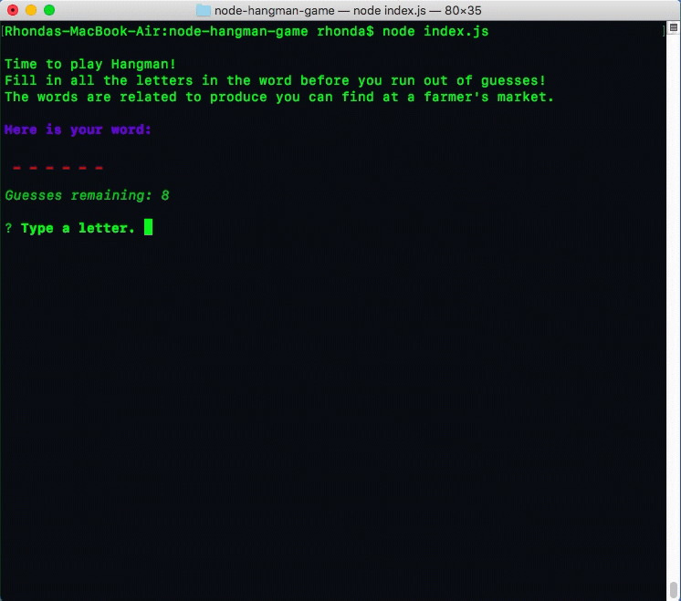

# Hangman at the farmer's market - Node.js edition

When you visit a farmer's market, think of all the fresh produce there. In this game, which is a digital version of Hangman, guess the letters in words representing items you can find at a farmer's market. Finish the word before you run out of guesses!

This is a command-line version of Hangman built with Node.js and constructors.

## Set up and installation

These must be installed to play the game:

- [Node.js](https://nodejs.org/en/)
- [npm](https://www.npmjs.com/get-npm)

## Play the game

In a terminal window, navigate into the folder where you downloaded this app and type `node index.js`.

When the game starts, a series of underscores appears to represent each letter in a word related to produce at the farmer's market. Type a letter, one at a time, to guess the word. When you guess a correct letter, the letter appears. Fill in all the letters before you run out of guesses.

As each round ends, a new one is started automatically until you have played all 10 of the words. Then, it is time for you to return home with your basket of fresh produce!

## Technology

- JavaScript, including constructors and prototypes
- Node.js
- npm, including [inquirer](https://www.npmjs.com/package/inquirer) and [chalk](https://www.npmjs.com/package/chalk) packages